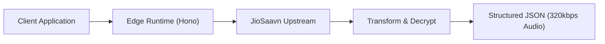

# ShnwazDev JioSaavn API

[](https://github.com/shnwazdeveloper/shnwazdev-jiosaavn-api/actions/workflows/ci.yaml)
[](https://www.typescriptlang.org/)
[](https://nodejs.org/)
[](https://hono.dev/)
[](https://swagger.io/specification/)
[](LICENSE)

Unofficial JioSaavn API and developer portal built for `shnwazdev`. Exposes comprehensive music metadata, 320kbps audio streams, albums, artists, browse feeds, synced lyrics, playlists, podcasts, radio, search, and trending charts through high-performance Hono and TypeScript edge runtimes.

---

## Highlights

- **Open Public Access**: No API keys, tokens, or registration required.
- **Zero Rate Limits**: No application-level throttling or artificial request caps.
- **Edge Native**: Ready for Cloudflare Workers and Vercel serverless deployments.
- **OpenAPI 3.1 & Scalar**: Interactive API reference and live request testing.
- **Type-Safe Models**: Robust validation with Zod schemas and full TypeScript coverage.
- **47+ Music Endpoints**: Complete coverage across search, songs, albums, artists, playlists, lyrics, radio, and feeds.

---

## Live Deployments

| Resource | Target | URL |
| :--- | :--- | :--- |
| **Website** | Production Portal | `https://shnwazdev-jiosaavn-apii.vercel.app/` |
| **Scalar Docs** | Interactive API Testing | `https://shnwazdev-jiosaavn-apii.vercel.app/docs` |
| **OpenAPI Spec** | Swagger Schema JSON | `https://shnwazdev-jiosaavn-apii.vercel.app/swagger` |
| **Health Check** | Status / Uptime Monitor | `https://shnwazdev-jiosaavn-apii.vercel.app/health` |
| **Endpoint Index** | Machine-Readable Catalog | `https://shnwazdev-jiosaavn-apii.vercel.app/api/endpoints` |
| **Limits Metadata** | Policy Information | `https://shnwazdev-jiosaavn-apii.vercel.app/api/limits` |

---

## Architecture Flow



---

## Quickstart

Fetch any endpoint directly using `curl` or standard HTTP clients:

```sh
# Health Check
curl "https://shnwazdev-jiosaavn-apii.vercel.app/health"

# Global Search
curl "https://shnwazdev-jiosaavn-apii.vercel.app/api/search?query=Believer"

# Scoped Song Search
curl "https://shnwazdev-jiosaavn-apii.vercel.app/api/search/songs?query=Kesariya"

# Song Details by ID
curl "https://shnwazdev-jiosaavn-apii.vercel.app/api/songs/csaAEio2"

# Song Details by JioSaavn URL
curl "https://shnwazdev-jiosaavn-apii.vercel.app/api/songs?link=https://www.jiosaavn.com/song/kesariya/CSkefRhCXmc"

# Top Trending Songs
curl "https://shnwazdev-jiosaavn-apii.vercel.app/api/trending/songs?limit=5"
```

---

## API Endpoints Reference

### Search

| Method | Endpoint | Description | Query Parameters |
| :--- | :--- | :--- | :--- |
| `GET` | `/api/search` | Search across songs, albums, artists, and playlists | `query` (required), `page`, `limit` |
| `GET` | `/api/search/songs` | Search songs | `query` (required), `page`, `limit` |
| `GET` | `/api/search/albums` | Search albums | `query` (required), `page`, `limit` |
| `GET` | `/api/search/artists` | Search artists | `query` (required), `page`, `limit` |
| `GET` | `/api/search/playlists` | Search playlists | `query` (required), `page`, `limit` |

### Songs

| Method | Endpoint | Description | Parameters |
| :--- | :--- | :--- | :--- |
| `GET` | `/api/songs` | Fetch songs by comma-separated IDs or song link | `ids` or `link` |
| `GET` | `/api/songs/{id}` | Fetch a single song with 320kbps streams | `id` in path |
| `GET` | `/api/songs/{id}/suggestions` | Recommendations based on song | `id` in path, `limit` |
| `GET` | `/api/songs/station` | Create a song radio station | `song_id` |

### Albums

| Method | Endpoint | Description | Parameters |
| :--- | :--- | :--- | :--- |
| `GET` | `/api/albums` | Retrieve album metadata and tracks | `id` or `link` |

### Artists

| Method | Endpoint | Description | Parameters |
| :--- | :--- | :--- | :--- |
| `GET` | `/api/artists` | Retrieve artist details | `id` or `link` |
| `GET` | `/api/artists/{id}` | Retrieve artist overview | `id` in path |
| `GET` | `/api/artists/{id}/songs` | Retrieve artist songs | `id` in path, `page`, `category`, `sort` |
| `GET` | `/api/artists/{id}/albums` | Retrieve artist albums | `id` in path, `page`, `category`, `sort` |
| `GET` | `/api/artists/{id}/related` | Retrieve related artists | `id` in path |
| `GET` | `/api/artists/by-name` | Search artist by name | `name` query param |

### Playlists

| Method | Endpoint | Description | Parameters |
| :--- | :--- | :--- | :--- |
| `GET` | `/api/playlists` | Retrieve playlist details and songs | `id` or `link`, `page`, `limit` |

### Lyrics

| Method | Endpoint | Description | Parameters |
| :--- | :--- | :--- | :--- |
| `GET` | `/api/lyrics` | Retrieve lyrics by song name query | `query` |
| `GET` | `/api/lyrics/{id}` | Retrieve lyrics by song or lyrics ID | `id` in path |
| `GET` | `/api/lyrics/{id}/sync` | Retrieve synchronized time-coded lyrics | `id` in path |

### Browse Feeds

| Method | Endpoint | Description |
| :--- | :--- | :--- |
| `GET` | `/api/home` | Full JioSaavn home feed |
| `GET` | `/api/home/modules` | Home feed module definitions |
| `GET` | `/api/home/promos` | Editorial promo groupings |
| `GET` | `/api/home/city-modules` | City trending modules |
| `GET` | `/api/home/artist-recommendations` | Home artist radio recommendations |
| `GET` | `/api/charts` | Top chart rankings |
| `GET` | `/api/channels` | Browse channels |
| `GET` | `/api/channels/{id}` | Channel detail payload |
| `GET` | `/api/discover` | Discover categories |
| `GET` | `/api/genres` | Music genre listings |
| `GET` | `/api/moods` | Mood-based categories |
| `GET` | `/api/music-plus` | Music plus stations |
| `GET` | `/api/radio` | Radio station categories |
| `GET` | `/api/radio/{id}` | Radio station stream payload |
| `GET` | `/api/radio/artists` | Artist radio categories |
| `GET` | `/api/radio/featured` | Featured radio channels |

### Podcasts

| Method | Endpoint | Description | Parameters |
| :--- | :--- | :--- | :--- |
| `GET` | `/api/podcasts` | Retrieve podcast shows by ID, token, or link | `id`, `token`, `link`, `query` |
| `GET` | `/api/podcasts/{id}` | Retrieve podcast show detail | `id` in path |
| `GET` | `/api/episodes/{id}` | Retrieve single episode detail | `id` in path |

### Trending

| Method | Endpoint | Description |
| :--- | :--- | :--- |
| `GET` | `/api/trending` | Aggregated trending overview |
| `GET` | `/api/trending/songs` | Trending songs list |
| `GET` | `/api/trending/albums` | Trending albums list |
| `GET` | `/api/trending/artists` | Trending artists list |
| `GET` | `/api/trending/playlists` | Trending playlists list |
| `GET` | `/api/trending/podcasts` | Trending podcast episodes |

---

## Response Schema

Responses follow a uniform envelope:

```json
{
  "success": true,
  "data": {
    "total": 1,
    "start": 0,
    "results": [
      {
        "id": "csaAEio2",
        "name": "Believer",
        "type": "song",
        "year": "2017",
        "duration": 204,
        "label": "Interscope Records",
        "language": "english",
        "hasLyrics": true,
        "url": "https://www.jiosaavn.com/song/believer/XScOACV-bVc",
        "downloadUrl": [
          { "quality": "12kbps", "url": "..." },
          { "quality": "48kbps", "url": "..." },
          { "quality": "96kbps", "url": "..." },
          { "quality": "160kbps", "url": "..." },
          { "quality": "320kbps", "url": "..." }
        ]
      }
    ]
  }
}
```

---

## Development

### Prerequisites

- Node.js >= 20.0.0
- npm >= 10.0.0

### Setup

```sh
# Clone repository
git clone https://github.com/shnwazdeveloper/shnwazdev-jiosaavn-api.git
cd shnwazdev-jiosaavn-api

# Install dependencies
npm ci

# Start local dev server with hot reload
npm run dev

# Run unit and integration tests
npm test

# Run linter
npm run lint

# Run typecheck and production build
npm run build
```

---

## Deployment

### Vercel Serverless

The repository includes a ready-to-deploy configuration:
- `vercel.json`: Handles routing, CORS headers, and function timeouts.
- `api/index.js`: Serverless handler mounting the Hono application.

```sh
npx vercel --prod
```

### Cloudflare Workers

Edge deployment via Wrangler:
- `wrangler.jsonc`: Cloudflare Worker configuration with `src/server.ts` entry.

```sh
npm run deploy:cf
```

---

## License

Released under the [MIT License](LICENSE). Built for educational and personal API integrations.
